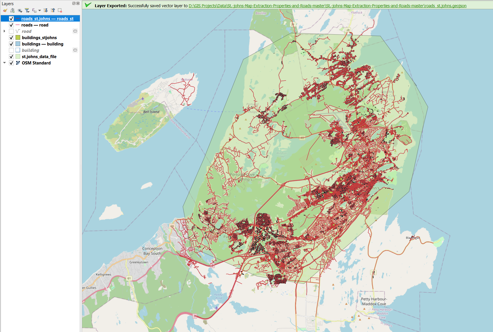
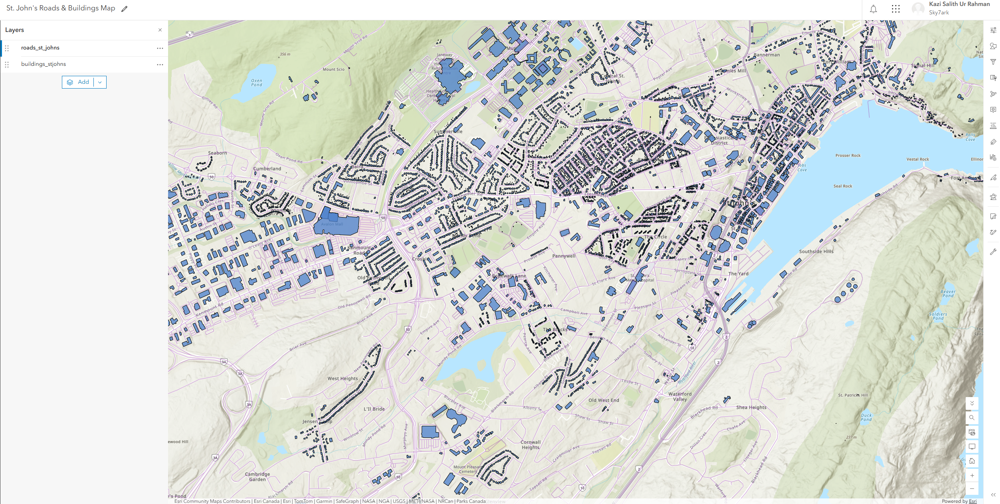
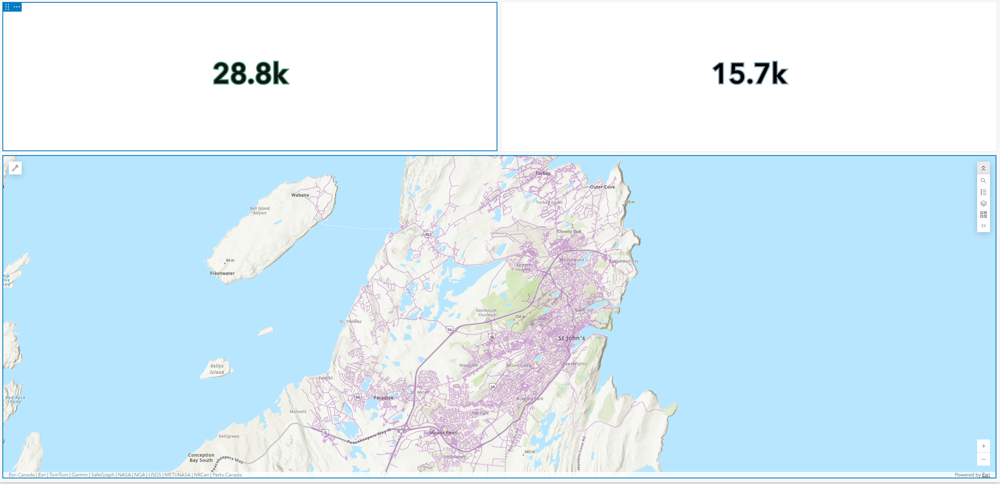
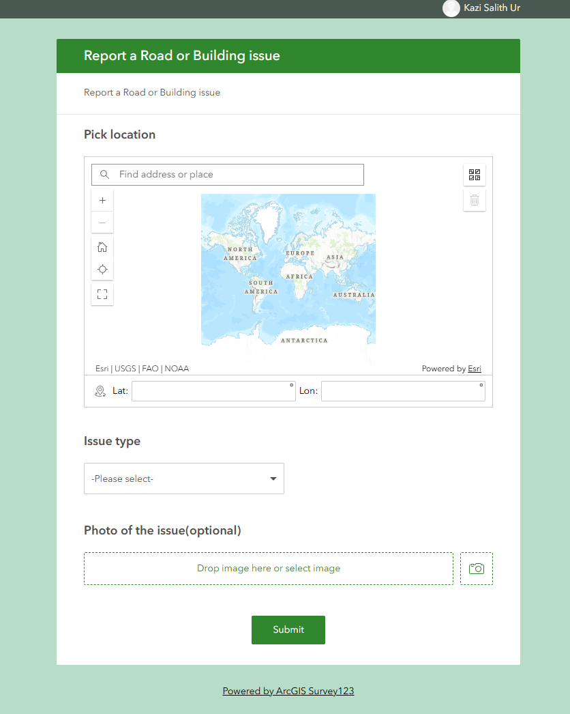

# St. John's Map Extraction — Properties and Roads

**Geospatial data extraction and multi-platform GIS analysis** — extracting building
and road network data for St. John's, NL from OpenStreetMap using QGIS, then
publishing and extending it through the ArcGIS Online ecosystem (Map Viewer,
Dashboards, Survey123).

---

## Project overview

This project extracts real-world building footprints and road networks for the
St. John's metro area using the **QuickOSM** plugin in QGIS, pulling directly
from OpenStreetMap. The extracted data is then taken beyond a single-platform
workflow: published as hosted feature layers in **ArcGIS Online**, visualized in
an interactive web map, summarized in a live **Dashboard**, and paired with a
**Survey123** field data-collection form — demonstrating the same dataset
handled across both the open-source (QGIS) and commercial Esri GIS stacks.

## Pipeline

1. **Extraction (QGIS + QuickOSM)** — pulled road and building footprint data
   for the St. John's area directly from OpenStreetMap, exported as GeoJSON
   (EPSG:4326).
2. **Publishing (ArcGIS Online)** — uploaded the GeoJSON exports as hosted
   feature layers, styled for clarity, and combined into a single interactive
   web map.
3. **Monitoring view (ArcGIS Dashboards)** — built a dashboard combining the
   live map with summary indicators (feature counts) for at-a-glance review.
4. **Field data collection (Survey123)** — designed a "Report a Road or
   Building Issue" form with a location picker, issue-type dropdown, and
   photo upload, demonstrating field-to-office data collection workflows.

## Screenshots

### 1. Source data extraction — QGIS
Buildings and roads extracted via QuickOSM/OpenStreetMap, styled and exported
to GeoJSON for downstream use.



### 2. Interactive web map — ArcGIS Online
Both layers published as hosted feature layers and combined into a styled,
interactive web map.



### 3. Operational dashboard — ArcGIS Dashboards
Live feature counts (28.8k roads, 15.7k buildings) alongside the interactive
map, built from the same hosted layers.



### 4. Field data collection form — Survey123
A published survey for reporting road or building issues, combining a location
picker, categorized issue type, and optional photo upload.



## Why no live public link

This project was built on an ArcGIS Online trial organization, which by
default restricts sharing items with "Everyone (public)" — a security setting
controlled at the organization level. The screenshots above demonstrate full,
working functionality of every component; the underlying items remain live
and accessible within the organization, and the workflow is fully
reproducible in any standard ArcGIS Online account with public sharing
enabled.

## Tools used

- **QGIS** + QuickOSM plugin — OpenStreetMap data extraction
- **ArcGIS Online** — hosted feature layers, Map Viewer
- **ArcGIS Dashboards** — live summary dashboard
- **ArcGIS Survey123** — field data collection form design

## Repository structure

```
├── README.md
├── screenshots/
│   ├── QGIS_Source_data.png
│   ├── ArcGIS_Online_web_map.png
│   ├── Dashboard.png
│   └── Survey123_Preview.png
├── roads_st_johns.geojson
├── buildings_stjohns.geojson
└── [original QGIS project files: .qgz, source .gpkg/.shp if applicable]
```

## Author

Salith — Computer Engineering, Memorial University of Newfoundland
